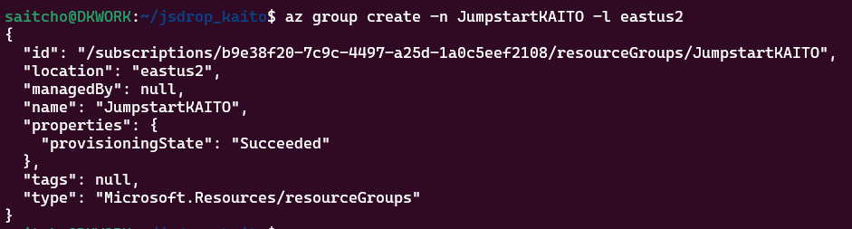

# Exploring KAITO enabled by Azure Arc - A Jumpstat Drop

## Introduction

This guide is designed to provide a comprehensive, step-by-step approach to deploying KAITO on Kubernetes clusters enabled by Azure Arc. Our mission is to help you get started quickly and efficiently, leveraging the power of KAITO and Azure Arc to enhance your AI and machine learning workflows. In this example, we will be using an AKS cluster to emulate a locally running Kubernetes cluster with a GPU node pool.

## Prerequisites

Before you begin, ensure you have the following:

* An Azure subscription with access to Azure Kubernetes Service (AKS) and Azure Arc.
* Available NCSv12 or other GPU quota in your Azure subscription.
* Access to the code by cloning [the repo](https://github.com/dkirby-ms/jsdrop_kaito) to a local dev folder.
* Azure CLI installed and logged into the Azure subscription you will use.

## Step-by-Step Guide

### Step 1: Setting Up a Kubernetes environment with GPU

In this guide we will use an AKS cluster to simulate an on-premises cluster with GPU. For this guide, you will need Compute quota for 24 Standard_NCSv3 series vCPU.

Open a Bash shell where you cloned the [GitHub repository](https://github.com/dkirby-ms/jsdrop_kaito). From the shell, run the following commands to create an Azure resource group and begin a deployment of AKS using a Bicep template.

    az group create -n JumpstartKAITO -l eastus2



    az deployment group create -g JumpstartKAITO -f infra/aks.bicep

### Step 2: Deploying KAITO

Next we will run the install_kaito.sh script to Arc-enable the cluster and deploy KAITO.

    - From the same shell, run the install_kaito.sh script.

    ```
    ./install_kaito.sh
    ```

### Step 3: Configuring KAITO

1. **Set Up Configuration Files**: Configure KAITO with the appropriate settings for your environment. This includes specifying the GPU nodes and any other relevant parameters.
2. **Test Deployment**: Run tests to ensure that KAITO is functioning correctly. Verify that the AI models are running on the GPU nodes and that the performance is optimal.

### Step 4: Monitoring and Maintenance

1. **Monitor Performance**: Use Azure Monitor and other tools to keep track of KAITO's performance. Ensure that the GPU nodes are being utilized effectively.
2. **Regular Updates**: Keep KAITO and your AKS cluster updated with the latest patches and improvements. Regularly check for updates and apply them as needed.

## Troubleshooting

### Common Issues

* **GPU Quota Issues**: If you encounter GPU quota issues, request quota relief through the appropriate channels. Ensure that your subscription has access to the necessary GPU resources.
* **Deployment Failures**: If KAITO fails to deploy, check the configuration files and ensure that all dependencies are installed correctly. Refer to the logs for more details on the errors.

## Support

For additional support, reach out to the Azure Arc Jumpstart Team or consult the documentation available on the Arc Jumpstart website.
